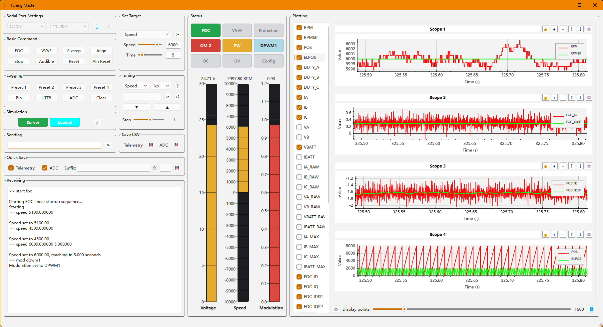

# Motor Drive Frontend

A Qt desktop GUI for controlling and monitoring the
[Motor Drive firmware](https://github.com/Team1Drive/Motor_Drive) from a host
machine over a virtual COM port.

The application sends motor-control commands, parses binary telemetry from the
MCU, plots selected signals on configurable oscilloscopes, displays live status
indicators and gauges, records CSV logs, and supports synchronized simulation
playback between two frontend instances.



A quick start guide is provided below, for more detailed instruction on using the software
as well as editing configuration file for customized display options, please refer to the
[User Manual](GUI_MANUAL.md).

## Features

- Serial connection management for USB virtual COM ports.
- One-click firmware commands for FOC, VVVF, six-step, stop, align, reset, and logging presets.
- Manual speed/torque target control with slider and exact text entry.
- Runtime tuning controls for configured firmware parameters, including enquire, increment/decrement, and undo.
- Binary telemetry parsing from configurable packet layouts in `telemetry_config.json`.
- Multi-scope plotting with selectable fields, drag-and-drop field assignment, color selection, pause, save, and fault-triggered capture.
- Live status LEDs and vertical gauges driven by configurable telemetry rules.
- Telemetry CSV logging, ADC sample CSV logging, and quick-save capture.
- Networked simulation mode using UDP discovery and TCP JSON-line synchronization.

## Run

The software can be downloaded and used out of the box from the release page.
Start the executable, choose the serial port and baud rate, then press the
start/stop serial button. The default baud rate in the UI is `115200`.

The firmware should send telemetry frames that match `telemetry_config.json`.
Text responses from the firmware are shown in the receive console and are also
used by the tuning controls.

## Telemetry Configuration

`telemetry_config.json` is the main runtime configuration. It defines:

- Telemetry packet fields and packet version layouts.
- ADC sample packet fields and layouts.
- Error bits and control mode names.
- Primary and secondary telemetry fields.
- Custom calculated fields.
- Status indicator rules.
- Gauge definitions and threshold bands.
- Runtime tuning subsystems and parameters.

`config_example.jsonc` documents the same structure with comments. The runtime
configuration must be strict JSON, so comments are allowed in the example file
but not in `telemetry_config.json`.

Field formats currently used by the parser are:

- `B`: unsigned 8-bit value.
- `H`: unsigned 16-bit little-endian value.
- `f`: 32-bit little-endian float.

## Logging

The frontend can write:

- Telemetry CSV rows using the configured telemetry fields.
- ADC sample CSV rows aligned by ADC sequence number.
- Quick-save captures that collect telemetry and/or ADC data for a short window.

The save buttons in the UI control these modes. Generated filenames are made
unique automatically to avoid overwriting existing captures.

## Simulation Mode

The simulation dialog can coordinate two frontend instances over a network:

- One instance acts as the server/coordinator.
- Another instance connects as the client.
- UDP discovery is used to find listening servers.
- TCP JSON-line messages synchronize prepare, ready, fire, finish, and abort events.

`simulation_example.csv` shows the expected CSV shape:

```csv
Time,Speed,Torque
0,0,0
0.1,0.972895,6.18757E-05
```

Use the simulation options dialog to map CSV columns to:

- Server target type and value.
- Client target type and value.
- Time column and unit.
- Start row.

The protocol schema is documented in `sync_protocol.json`.

## Development Requirements

- CMake 3.16 or newer.
- A C++17 compiler.
- Qt 6 with these modules:
  - Core
  - Widgets
  - SerialPort
  - Network
  - PrintSupport
  - Charts
- On Windows, MinGW is the expected toolchain for the included `qt-x86` CMake preset.

## Build

From the repository root:

```powershell
cmake --preset qt-x86
cmake --build --preset qt-x86
```

The build target copies these runtime files beside the executable:

- `telemetry_config.json`
- `config_example.jsonc`
- `sync_protocol.json`
- `simulation_example.csv`

If CMake cannot find Qt, configure with your Qt installation on the path or set
`CMAKE_PREFIX_PATH` to the Qt CMake directory, for example:

```powershell
cmake --preset qt-x86 -DCMAKE_PREFIX_PATH="C:/Qt/6.x.x/mingw_64"
```

## Package On Windows

The CMake file defines a `package` target for Windows builds. It copies the
executable, deploys Qt runtime files with `windeployqt`, and adds MinGW runtime
DLLs:

```powershell
cmake --build out/build/qt-x86 --target package
```

The packaged output is written to:

```text
out/build/release
```

## Repository Map

- `main.cpp`: application entry point.
- `mainwindow.*` and `mainwindow.ui`: main GUI, serial controls, plotting, logging, tuning, gauges, and status indicators.
- `serialmanager.*`: `QSerialPort` wrapper used from the serial worker thread.
- `dataparser.*`: incremental binary/text parser, configuration loader, telemetry/ADC extraction, and parser-side CSV logging.
- `oscilloscopewidget.*`: reusable multi-trace `QCustomPlot` widget.
- `audiolevelmeter.*`: custom vertical gauge widget.
- `simulationdialog.*` and `simulationdialog.ui`: networked simulation coordinator/client dialog.
- `simulationoptionsdialog.*` and `simulationoptionsdialog.ui`: CSV column mapping dialog.
- `draglistwidget.*`: drag support for field-list interaction.
- `qcustomplot.*`: bundled plotting library.
- `telemetry_config.json`: active parser/UI configuration.
- `config_example.jsonc`: commented configuration reference.
- `sync_protocol.json`: synchronized simulation protocol reference.
- `simulation_example.csv`: sample simulation input data.

## Development Notes

- Keep firmware log command names in `telemetry_config.json` aligned with the MCU command interface.
- When adding new telemetry fields, update the relevant mask bit, byte size, format, and command name.
- When changing packet structure, update both `telemetry_fields` and `telemetry_structure`.
- The app expects `telemetry_config.json` beside the executable at runtime; the CMake post-build step copies it automatically.
- The GUI is currently organized around Qt Designer `.ui` files plus C++ widget/controller code.
